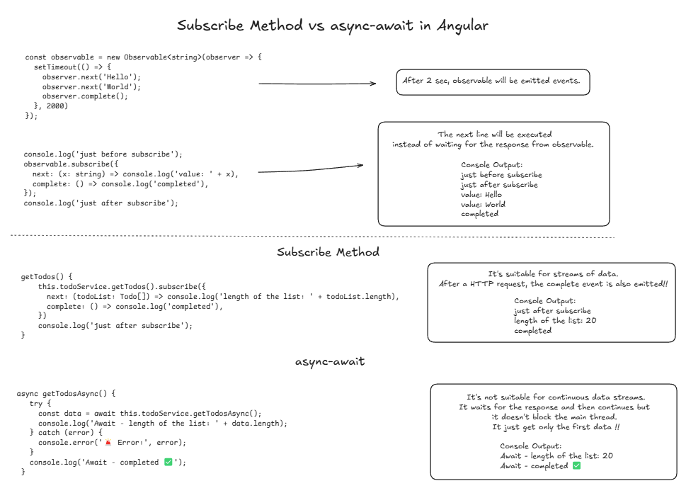

#### *Important!!!*
When making consecutive requests that need to wait for each other, async-await is the better choice. This is because subscribe can lead to callback hell, especially when dealing with sequential operations. Using async-await makes the code cleaner, more readable, and easier to manage, as it avoids nested callbacks and simplifies error handling.

# App

This project was generated using [Angular CLI](https://github.com/angular/angular-cli) version 19.1.5.

## Development server

To start a local development server, run:

```bash
ng serve
```

Once the server is running, open your browser and navigate to `http://localhost:4200/`. The application will automatically reload whenever you modify any of the source files.
